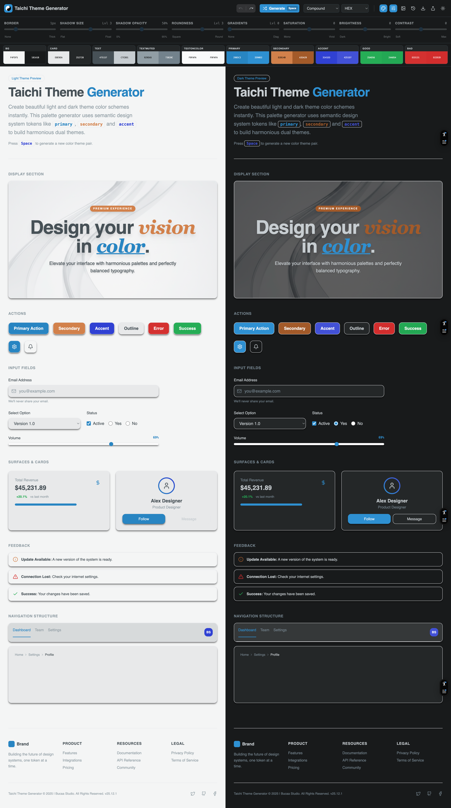

# Taichi Theme Generator

<div align="center">
  

**A powerful dual-theme color palette generator with real-time preview**

[](https://taichi.bucaastudio.com)
[](https://vercel.com)
[](LICENSE)

</div>

<div align="center">
  
</div>

## Features

- **Dual Theme Generation** - Simultaneously generate perfectly matched light
  and dark themes
- **Multiple Color Harmonies** - Random, Monochrome, Analogous, Complementary,
  Split-Complementary, and Triadic
- **Advanced Controls**
  - Saturation levels (0-4): From pure grayscale to maximum saturation
  - Contrast levels (1-5): Fine-tune readability and visual impact
  - Border width, shadow strength, roundness, and gradient controls
- **Smart Color Formats** - Export in HEX, RGB, CMYK, HSL, LAB, LCH, OKLCH, or
  Display P3
- **Image Color Extraction** - Generate palettes from uploaded images
- **History Management** - FIFO history with up to 20 saved themes
- **Keyboard Shortcuts**
  - `Space` - Generate new theme
  - `Cmd/Ctrl + Z` - Undo
- **Live Preview** - See your theme applied to real UI components instantly
- **Export & Import** - Save themes as JSON files with your preferred color
  format
- **API Endpoints** - Programmatic access to theme generation and export
  - Generate themes via REST API
  - Export themes in multiple formats (CSS, SCSS, Tailwind, etc.)
  - Rate-limited for Vercel free tier
  - LLM-friendly with comprehensive documentation

## Live Demo

Visit [taichi.bucaastudio.com](https://taichi.bucaastudio.com) to try it out!

## Tech Stack

- **Framework**: React 19 + TypeScript
- **Build Tool**: Vite
- **Styling**: Tailwind CSS
- **Icons**: Lucide React
- **Deployment**: Vercel

## Installation

### Prerequisites

- Node.js 18+
- npm or yarn

### Setup

1. **Clone the repository**
   ```bash
   git clone https://github.com/bluevisor/Taichi-Color-Generator.git
   cd Taichi-Color-Generator
   ```

2. **Install dependencies**
   ```bash
   npm install
   ```

3. **Run development server**
   ```bash
   npm run dev
   ```

4. **Open your browser**
   ```
   http://localhost:3000
   ```

## Build for Production

```bash
npm run build
npm run preview
```

## Usage

### Generating Themes

1. **Select a color harmony mode** from the dropdown (Random, Monochrome, etc.)
2. **Adjust design options** using the sliders:
   - **Saturation**: 0 (grayscale) to 4 (vivid)
   - **Contrast**: 1 (soft) to 5 (maximum)
   - **Roundness**: 0 (square) to 5 (fully rounded)
   - **Shadows**: 0 (flat) to 5 (floating)
   - **Gradients**: 0 (solid) to 2 (vivid)
3. **Press Space** or click "Generate" to create a new theme
4. **View the preview** - See your theme applied to both light and dark modes
   side-by-side

### Color Palette Strip

- Click any color swatch to **copy** the color value
- Click the color name to **edit** the color manually
- Switch between **HEX, RGB, CMYK, HSL, LAB, LCH, OKLCH, and Display P3**
  formats
- View 8 key colors: bg, surface, text, primary, secondary, accent, success,
  error

### Exporting Themes

1. Click the **Download** button in the toolbar
2. Your theme will be exported as JSON with colors in your selected format
3. The file includes both light and dark variants plus metadata

### History

- **New themes appear on the left** (FIFO order)
- **Maximum 20 themes** stored
- Click any history item to restore that theme
- History is **persisted** in localStorage

## Color System

The generator creates comprehensive design tokens:

- **Backgrounds**: `bg`, `surface`, `surface2`
- **Text**: `text`, `textMuted`
- **Brand**: `primary`, `secondary`, `accent`
- **Semantic**: `success`, `warn`, `error`
- **UI**: `border`, `ring`
- **Foregrounds**: `primaryFg`, `secondaryFg`, etc.

## API Documentation

The Taichi Color Generator provides REST API endpoints for programmatic theme
generation and export.

### Quick Start

```javascript
// Generate a Yin-Yang style theme
const response = await fetch("/api/generate-theme", {
  method: "POST",
  headers: { "Content-Type": "application/json" },
  body: JSON.stringify({
    style: "yin-yang",
    baseColor: "#3B82F6",
  }),
});
const { theme, metadata } = await response.json();
```

### Available Endpoints

- **POST /api/generate-theme** - Generate Taichi-inspired themes (10 req/min)
- **POST /api/export-theme** - Export themes in multiple formats (15 req/min)
- **GET /api/theme-history** - Retrieve theme history (20 req/min)

### Documentation

- 📖 [Complete API Documentation](./API_DOCUMENTATION.md)
- ⚡ [Quick Reference](./API_QUICK_REFERENCE.md)
- 💻 [API Client Utilities](./utils/api-client.ts)

All endpoints are rate-limited for Vercel's free tier and designed to be
LLM-friendly.

## Contributing

Contributions are welcome! Please feel free to submit a Pull Request.

## License

MIT License - feel free to use this project for personal or commercial purposes.

## Credits

Created by [Bucaa Studio](https://bucaastudio.com)

---

<div align="center">
  Made with care using the Taichi philosophy of balance and harmony
</div>
